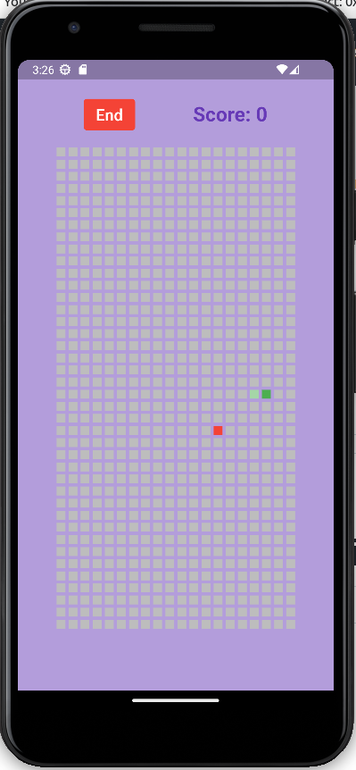

# Snake Game using Flutter

### simple implementation of the classic Snake game using the Flutter framework.

The MyApp class is the root widget of the application, and it creates a SnakeGame widget as its home page.

The SnakeGame widget is a stateful widget that holds the game logic and the state of the game. It has a build() method that returns the UI of the game.

The game is played on a grid of squaresPerRow by squaresPerCol squares, with the snake represented as a list of coordinates (x, y) on the grid. The direction of the snake is stored in the direction variable, and the food is represented as a single (x, y) coordinate.

The game starts when the "Start" button is pressed, which sets the isPlaying flag to true and starts a timer that calls the moveSnake() function every duration milliseconds. The moveSnake() function updates the position of the snake based on the direction, and checks if the snake has collided with the wall or with itself. If the snake has collided, the endGame() function is called, which sets the isPlaying flag to false and shows a dialog with the score.

The game ends when the "End" button is pressed, which cancels the timer and sets the isPlaying flag to false.

## Made by [Jaafar Fares](https://github.com/jaafarfares)
